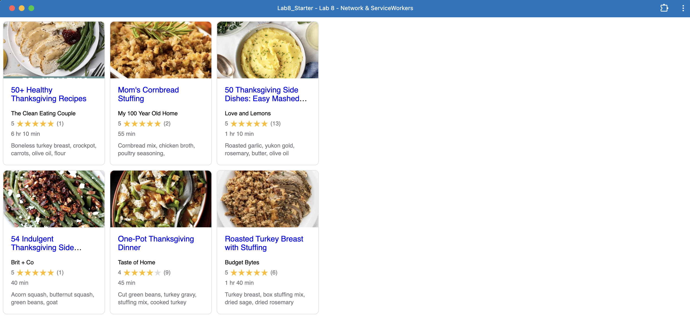

# Lab8-Starter

**Name: Mohammed Azab**

**GitHub pages site:**
https://mazab2003.github.io/Lab8_Starter/

Graceful degradation means a website stays usable even when browser features or connectivity disappear. A service worker is a key tool on the network side that makes this possible. It caches files on the first visit, if the user's connection slows down or stop, it serves those local copies instead to keep the visual site unchanged. 

